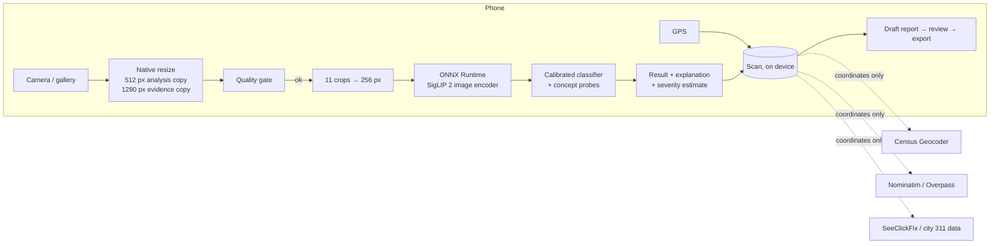

# CivicLens

**See it. Understand it. Act on it.**

CivicLens is a mobile app for reporting problems in public infrastructure.
Point your phone at a pothole, graffiti or an overflowing trash can. An
on-device vision model says what it sees and how sure it is. The app finds
the city or county responsible, checks whether someone already reported the
problem, and helps you write a clear report that you review and send
yourself.

Built with Expo (React Native, TypeScript) for the Congressional App
Challenge.

> **Status, honestly.** The app and its analysis code were written and
> tested in a Linux build environment without an Android or iOS device or
> emulator. The vision model, the analysis pipeline, the report logic and
> the data parsers are covered by automated tests, and the model's accuracy
> was measured on 960 held-out photos through the exact TypeScript code the
> app runs. **The app has not yet been run on a physical phone**, and the
> live civic data services (Census, OpenStreetMap, SeeClickFix, city 311
> portals) could not be reached from the build environment. See
> [Limitations](#limitations).

---

## Contents

- [What it does](#what-it-does)
- [Measured accuracy](#measured-accuracy)
- [Getting started](#getting-started)
- [Configuration](#configuration)
- [Architecture](#architecture)
- [How the vision model works](#how-the-vision-model-works)
- [Civic data](#civic-data)
- [Privacy and security](#privacy-and-security)
- [Accessibility](#accessibility)
- [Testing](#testing)
- [Developer tools](#developer-tools)
- [Limitations](#limitations)
- [Data sources and licenses](#data-sources-and-licenses)

---

## What it does

**See it**
- A camera-first scanner. While the camera is open, CivicLens analyzes about
  one frame per second and only says "detected" after the same issue shows
  up across 3 recent frames, so a single odd frame can't trigger it.
- Tap **Scan** for a full analysis: a photo quality check, then 11 views of
  the photo (whole frame, center, and a 3×3 grid of overlapping crops) so a
  small pothole in a wide street scene isn't missed.
- Results are honest. Each scan ends in one of four states: **detected**,
  **not sure** (with the top guesses), **no recognized issue**, or **photo
  rejected** (too blurry, dark, washed out, covered or small). A rejected
  photo always comes with a reason and a fix ("Turn on the flashlight").
- The model recognizes **potholes, pavement cracks, graffiti, flooding,
  overflowing trash and illegal dumping**. For other problems (damaged
  signs, sidewalk damage, fallen trees, blocked sidewalks) it says it doesn't
  recognize them, and you choose the issue type yourself.

**Understand it**
- GPS location with accuracy shown as good / fair / poor.
- The responsible jurisdiction from the US Census Geocoder (city, county,
  state). State highways go to the state DOT, using OpenStreetMap road data.
- The likely department and the official 311 page for 15 large US cities,
  with an honest "general" fallback elsewhere.
- **Duplicate check** against public 311 data (SeeClickFix, NYC, San
  Francisco, Chicago) and your own scans: "A similar pothole was reported
  40 ft away 3 days ago." You can view it, mark the problem as still
  present, or report it anyway.
- A map of your scans and nearby public reports, with clustering, filters
  and sorting.
- An issue detail page that explains *why* CivicLens thinks so (the visual
  cues it found, the region of the photo, the confidence), and what the
  result does **not** mean. For example: "Potential accessibility
  obstruction" is a visual observation, not an ADA determination.

**Act on it**
- You confirm the issue type before anything is drafted. The AI suggests;
  you decide.
- A structured report (category, location, jurisdiction, severity estimate,
  description, photo) that you can edit, with a readiness checklist.
- A review step, then export: **PDF, share sheet, copy, email draft, or the
  city's official 311 page**. CivicLens **never submits anything to a
  government agency** on your behalf.
- History with an impact summary (issues identified, reports created,
  duplicates avoided, resolved). Only reviewed scans count.

**Also**
- Onboarding, Settings with a **Local-only mode**, an About page with the
  measured accuracy and its limits, and a clearly labeled **Demo Mode** that
  runs six sample photos through the real pipeline.
- Works offline: scans and reports are saved on the phone, and address,
  jurisdiction and duplicate lookups are queued until you're back online.

## Measured accuracy

Measured on the held-out test split (960 photos the model never saw in
training), through the same TypeScript pipeline the app runs, at the app's
512 px analysis resolution. Thresholds were chosen on a separate validation
split. 95% Wilson confidence intervals in brackets. Full report:
[docs/EVALUATION.md](docs/EVALUATION.md).

| Issue | Test photos | Precision | Recall |
| --- | ---: | --- | --- |
| Pothole | 311 | 97.9% [95.6–99.1] | 91.6% [88.0–94.2] |
| Pavement crack | 173 | 96.4% [92.5–98.4] | 94.2% [89.7–96.8] |
| Graffiti | 28 | 90.0% [74.4–96.5] | 96.4% [82.3–99.4] |
| Flooding | 16 | 100% [80.6–100] | 100% [80.6–100] |
| Overflowing trash | 10 | 64.3% [38.8–83.7] | 90.0% [59.6–98.2] |
| Illegal dumping | 6 | 57.1% [25.0–84.2] | 66.7% [30.0–90.3] |

- **False alarms:** 3.4% [2.0–5.6] of 416 ordinary street scenes were
  flagged as an issue.
- **"High confidence" detections** were correct 99.3% [97.8–99.7] of the
  time (402 of 405).
- **Quality gate:** 10 of 960 test photos (1%) were rejected as unusable.

**Read these numbers with care.** The test photos are web and research
photos, not phone photos taken on real streets. The pothole and crack test
photos come from the same research datasets as the training photos, which
flatters those two classes. Labels for the other photos were reviewed by an
AI assistant, not a person. Trash and dumping have very few test photos, so
their intervals are wide. Accuracy on a real street will likely be lower.
The evaluation document lists every caveat.

## Getting started

### Prerequisites

- Node.js 22 and npm
- For Android: Android Studio with an SDK (API 26+) and a device or emulator
- For iOS: macOS with Xcode 16+ and CocoaPods
- Optional: an [Expo](https://expo.dev) account and `eas-cli` for cloud builds

CivicLens uses native modules that **Expo Go does not include**
(ONNX Runtime and MapLibre), so it runs in a development build, not Expo Go.

### Install

```bash
git clone https://github.com/NeilGilani/congchal.git
cd congchal
npm install
```

`npm install` also:
1. applies `patches/onnxruntime-react-native+1.24.3.patch` (a fix for React
   Native's New Architecture, which Expo SDK 57 requires), and
2. assembles the 114 MB vision model `assets/models/civiclens_vision.onnx`
   from the two committed parts and checks its SHA-256
   (`scripts/assemble-model.js`).

### Run on a device

```bash
# Android (device connected over USB, or an emulator running)
npx expo run:android

# iOS (macOS only)
npx expo run:ios
```

These commands generate the native projects (`android/`, `ios/`, which are
git-ignored), build a development client and start Metro.

### Build with EAS

```bash
npm install -g eas-cli
eas login
eas build --profile development --platform android   # dev client APK
eas build --profile preview --platform android       # installable APK
eas build --profile production --platform ios        # App Store build
```

Profiles are defined in [eas.json](eas.json).

### Try it without a street full of potholes

Open **Settings → Demo Mode** (or "Try Demo Mode first" at the end of
onboarding). Six sample photos run through the real on-device analysis. The
results are not scripted: the damaged sign and the blocked sidewalk come
back as "no recognized issue", because the model wasn't trained on them.

## Configuration

Copy `.env.example` to `.env`. Every variable is optional.

| Variable | Purpose |
| --- | --- |
| `EXPO_PUBLIC_MAP_STYLE_URL` | MapLibre style URL. Default: OpenFreeMap "dark", no key needed. |
| `EXPO_PUBLIC_REMOTE_INFERENCE_URL` | Optional analysis server for phones that can't run the model (see below). |
| `EXPO_PUBLIC_OSM_CONTACT` | Contact string for the User-Agent sent to OpenStreetMap services, as their usage policies request. |
| `EXPO_PUBLIC_SOCRATA_APP_TOKEN` | Optional Socrata app token for higher rate limits on city open data. |

`EXPO_PUBLIC_*` values are compiled into the app, so none of them may be a
secret. CivicLens needs no API keys.

### Optional remote analysis server

For phones where the on-device runtime fails, a small server serves the
same model over the local network:

```bash
npm run server                # listens on 0.0.0.0:8787
```

Set `EXPO_PUBLIC_REMOTE_INFERENCE_URL=http://<laptop-ip>:8787` and turn on
**Settings → Cloud image analysis**. It is off by default, disabled in
Local-only mode, and only receives 256 × 256 pixel crops. The server has no
authentication: use it on a trusted network for development or a demo only.

## Architecture



```
src/
  app/            expo-router routes (thin wrappers around screens)
  screens/        screen components; dev/ holds the hidden developer tools
  components/     design system: typography, buttons, cards, badges, map
  hooks/          camera live analysis, location, network, storage bindings
  ml/             analysis pipeline: quality gate, regions, head, explanations,
                  severity, temporal fusion; runtime/ holds the ONNX backends
  services/       detection, scan, report/export, location, jurisdiction,
                  civic data, duplicates, sync queue, impact, demo
  api/            fetch wrapper: timeouts, retries, zod validation, latency log
  storage/        AsyncStorage collections, TTL cache, photo files
  models/         TypeScript domain types
  constants/      theme, categories, config, demo scenarios
assets/models/    vision model (two parts + manifest) and classifier head
tools/ml/         model conversion, dataset tooling, training, evaluation
server/           optional remote analysis server
tests/            unit and integration tests (Jest)
docs/             evaluation report and raw results
```

Key decisions:
- **On-device first.** Analysis never needs a network connection. The
  remote server is an opt-in fallback.
- **One pipeline everywhere.** The phone, the evaluation script, the
  integration tests and the remote server all run the same TypeScript
  pipeline and the same ONNX file. The evaluation measures what ships.
- **Storage** is AsyncStorage, one key per record plus an index, with
  serialized writes. Demo data lives in its own namespace so it can never
  mix with real scans or impact stats.
- **External data is validated** with zod at the boundary. Every lookup
  fails independently, and failures are shown ("Couldn't check SeeClickFix:
  timeout"), never hidden.

## How the vision model works

1. **Model.** The image encoder of Google's
   [SigLIP 2](https://arxiv.org/abs/2502.14786) B/32 at 256 px, ported from
   the official JAX checkpoint to PyTorch (`tools/ml/siglip_torch.py`),
   checked against the reference implementation
   (`tools/ml/verify_parity.py`), exported to ONNX and quantized to 8-bit
   weights (`MatMulNBits`, block 32). Image-scaling is built into the graph.
   Size: 114 MB (fp32: 378 MB). On 64 real photos its embeddings match the
   fp32 model with a mean cosine similarity of 0.9995 (minimum 0.998; see
   [docs/eval/quantization.json](docs/eval/quantization.json)).
2. **Classifier head.** A linear classifier over the 768-dimensional
   embedding with 7 outputs (6 issues plus "no issue"), trained on 2,886
   labeled photos. It is regularized toward SigLIP's zero-shot text
   prototypes, so classes with few examples stay sensible. Temperature
   scaling and the decision thresholds were fitted on a validation split.
3. **Quality gate.** Sharpness (variance of the Laplacian), brightness,
   clipping, contrast, flat-area ratio and resolution, calibrated on real
   photos ([docs/eval/quality-calibration.json](docs/eval/quality-calibration.json)).
   It rejects under 1% of normal photos.
4. **Regions.** 11 crops per scan. The issue score combines the whole photo
   and the crops. A crop can only "rescue" a detection the whole photo
   missed when it is very confident (≥ 0.9). The outlined region is where
   the evidence was strongest, not a precise object boundary.
5. **Decision.** ≥ 0.55 calibrated probability = detected (≥ 0.9 = high
   confidence); 0.35–0.55 = not sure; below = no recognized issue.
6. **Explanations.** 34 text "concept probes" (for example "water-filled
   hole", "spray-painted tags", "blocks a wheelchair") are compared with
   the image embedding and expressed as standard scores relative to ordinary
   street scenes. Strong cues are shown as evidence and feed the severity
   estimate.
7. **Severity.** An estimate from category hazard, visible cues (safety,
   accessibility, size, location, obstruction) and confidence. Low-confidence
   results are pulled toward "moderate". It is labeled as an estimate and
   can be changed by the user.

Typical analysis time on the build machine's CPU: ~0.4 s per full scan
(11 crops). Phone timing has not been measured yet; the debug panel shows
it on a real device.

## Civic data

| Need | Source | Notes |
| --- | --- | --- |
| Jurisdiction | US Census Bureau Geocoder | Authoritative city/county/state with GEOIDs. Decides city vs county responsibility. |
| Address | Phone's geocoder, then Nominatim | Display only. |
| Road ownership | Overpass (OpenStreetMap) | State and US routes are routed to the state DOT. |
| Department and official link | Built-in directory of 15 cities | Links are each city's official 311 page. Elsewhere, a clearly marked general fallback. |
| Existing reports | SeeClickFix API v2; Socrata 311 data for New York City, San Francisco and Chicago | Used for duplicate detection and the map. |

**Duplicate detection** looks within a radius set by GPS accuracy (50–150 m)
and scores each report by category similarity × distance × status (recently
closed reports count less; old ones are ignored). It never blocks you from
reporting.

**Offline.** Scans taken offline keep a list of pending lookups. A small
worker finishes them when the network returns or the app comes back to the
foreground. Lookups are cached (memory and disk) so places you've been work
offline.

## Privacy and security

- Photos are analyzed on the phone and stored in the app's private storage.
  They leave the phone only when you share or export a report, or if you
  turn on cloud analysis.
- Location is requested only while the app is in use, never in the
  background. Only coordinates (never photos) go to public civic data
  services, and you can turn that off.
- **Local-only mode** turns off cloud analysis and all civic lookups.
- No accounts, no analytics, no tracking. Logs hold metrics only, never
  coordinates, addresses or descriptions.
- User text is sanitized and HTML-escaped in exported reports. API
  responses are validated before use.
- No API keys are needed or committed. `.env` is git-ignored; see
  `.env.example`.
- The Android build blocks the microphone and background-location
  permissions.

## Accessibility

- Every control has an accessibility label and role, with hints where
  needed. Results are announced, with haptics on native platforms.
- Color is never the only signal: confidence, severity and status always
  include text.
- Text follows the system font size (with a cap so layouts don't break).
- 48 pt minimum touch targets.
- Reduce Motion is respected, with an extra in-app setting.

## Testing

```bash
npm test             # Jest: unit and integration tests
npm run typecheck    # strict TypeScript for the app, tools, server and tests
npm run lint         # ESLint (expo config)
npm run evaluate -- --dataset tools/ml/dataset/dataset.json \
  --data-root <images> --out docs/eval/results.json --robustness 25
```

The integration tests load the real 114 MB model with ONNX Runtime for
Node and run bundled photos through the full pipeline (camera photo →
analysis → scan → report). The unit tests cover the quality gate, temporal
fusion, the classifier head, severity, explanations, Census and Nominatim
parsing, department matching, duplicate scoring, report validation and
formatting (including HTML escaping), the HTTP client's error handling,
storage, EXIF location, and impact stats.

Reproducing the model and dataset is described in
[tools/ml/README.md](tools/ml/README.md).

## Developer tools

Tap the version number in **Settings** seven times to turn on developer
mode. It adds:
- **Debug panel:** model state and thresholds, last scan latency and
  resolution, GPS accuracy, network state, API latency, cache hit rates and
  the structured log.
- **Evaluation tool:** run any photo through the pipeline, see the raw class
  probabilities, region scores and concept scores, and record the true label
  to measure accuracy on your own phone photos. Results export as JSON.

From the shell, `npx tsx tools/ml/analyze.ts photo.jpg` runs the same
analysis on any JPEG.

## Limitations

- **Not yet tested on a phone.** No Android or iOS device or emulator was
  available while building. TypeScript, lint, Jest and the Metro bundle
  were verified; native behavior (camera, ONNX Runtime on device, MapLibre,
  PDF export) still needs a device test. Phone analysis speed is unknown.
- **Live services untested.** The Census, Nominatim, Overpass,
  SeeClickFix, Socrata and OpenFreeMap requests and parsers are written
  against the documented formats and tested with fixtures, but the
  build environment could not reach those services.
- **Training and test photos are not phone photos.** They come from Open
  Images (Flickr), pothole and crack research datasets. Real phone photos
  will differ.
- **AI-reviewed labels.** Most non-road labels were reviewed by an AI
  assistant, not a person ([LABELING.md](tools/ml/dataset/LABELING.md)).
- **Six categories.** Damaged signs, sidewalk damage, fallen trees and
  blocked sidewalks had too few clean examples to train and test honestly.
- **Few examples for trash and dumping** (10 and 6 test photos), so their
  accuracy is uncertain, and the two are sometimes confused.
- **Night and heavy blur** are rejected rather than analyzed (by design).
- **The outlined region is approximate.** It marks the crop with the
  strongest evidence, not the object's outline.
- **Severity is an estimate** from visual cues, not an engineering
  assessment. Nothing in CivicLens is a legal or ADA determination.
- **App size.** The 114 MB vision model is bundled in the app, so the
  install is large. Downloading it on first launch would shrink the install
  but break offline-first use, so it was not done.
- **Department directory covers 15 cities.** Elsewhere you get the
  jurisdiction and a general search link.

## Data sources and licenses

| What | Source | License / terms |
| --- | --- | --- |
| Vision model | SigLIP 2 B/32 (Google, big_vision) | Apache 2.0 |
| Training photos | Open Images V7 | Images CC BY 2.0, annotations CC BY 4.0 |
| Pothole photos | Pothole Dataset (Chitale et al., IVCNZ 2020) | Research dataset, see its repository |
| Crack photos | DeepCrack (Liu et al., 2019); CrackForest (Shi et al., 2016) | Research and educational use |
| Demo photos | Six Open Images / Flickr photos | CC BY 2.0, credited in the app |
| Jurisdiction | US Census Bureau Geocoder | Public domain (US government) |
| Addresses, roads, map data | OpenStreetMap via Nominatim and Overpass | ODbL, © OpenStreetMap contributors |
| Map tiles | OpenFreeMap / OpenMapTiles | Free, attribution required |
| Public reports | SeeClickFix API; NYC, San Francisco and Chicago open data | Each provider's terms |

No training photos ship with the app; only the classifier weights learned
from them do. Because DeepCrack is licensed for research and educational
use, a commercial release would need the classifier retrained without it.

Runtime libraries: Expo and React Native (MIT), ONNX Runtime (MIT), MapLibre
React Native (MIT) and MapLibre Native (BSD-2), Lucide icons (ISC), zod
(MIT), jpeg-js (BSD-3), Inter and JetBrains Mono fonts (OFL).
